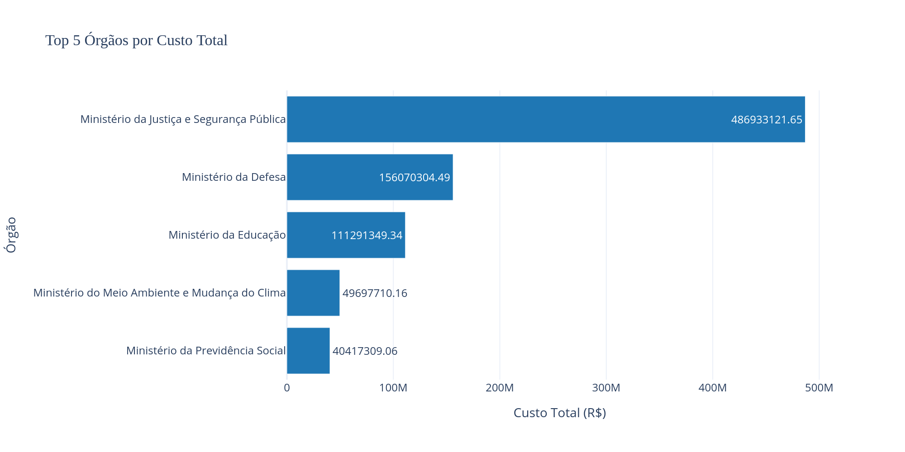
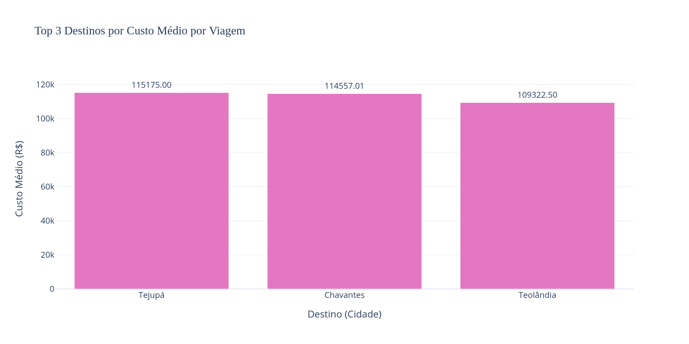
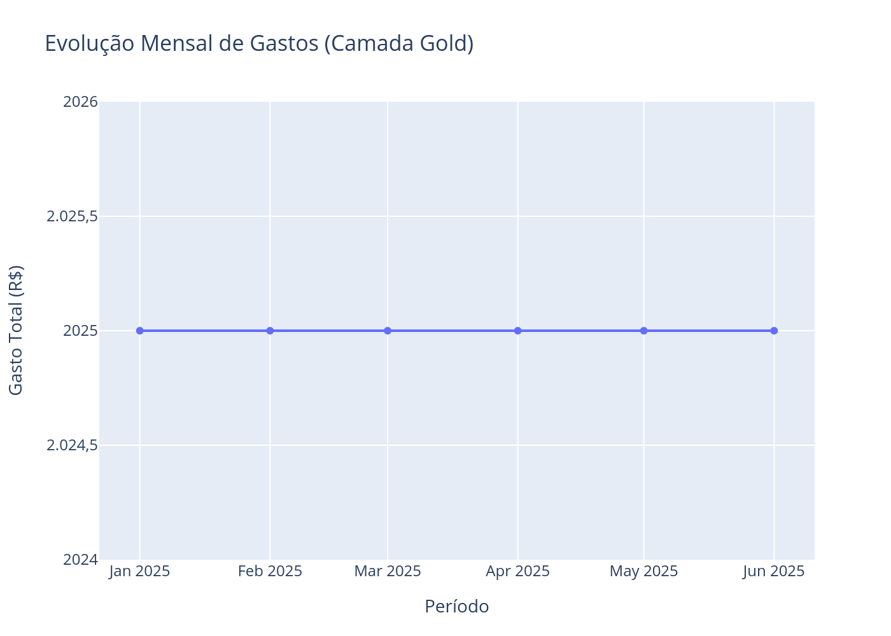
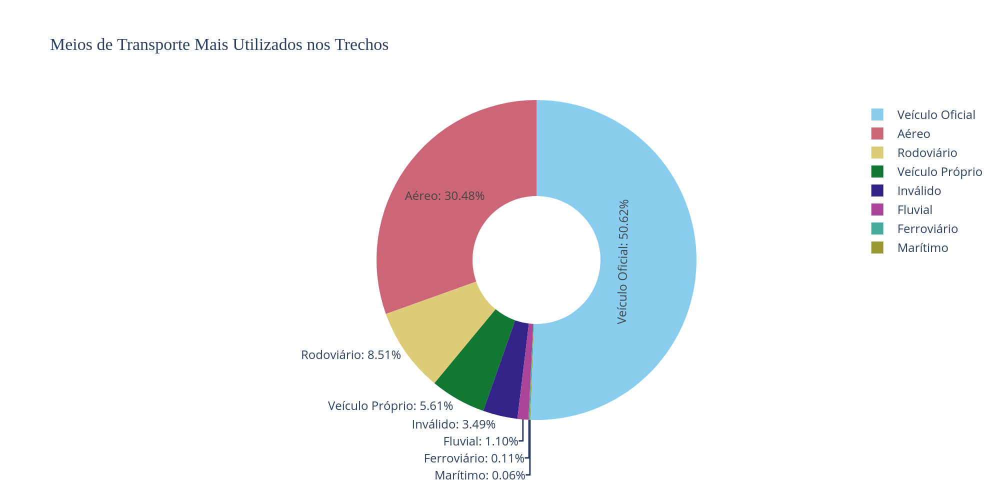
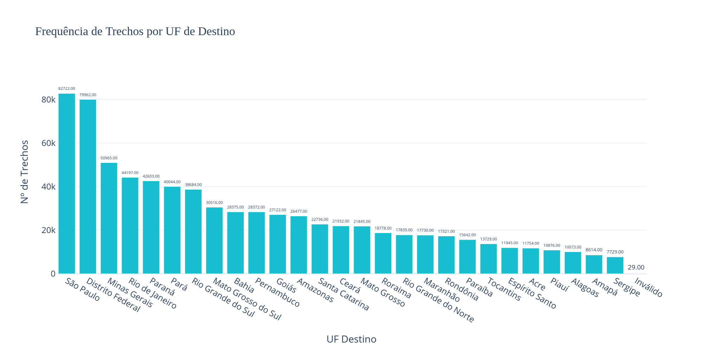
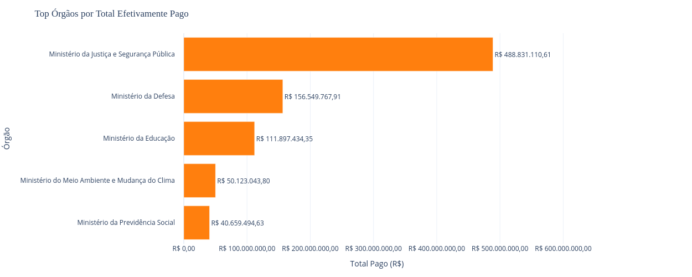

## Análises e Resultados (Camada Gold)

Abaixo estão apresentadas as respostas para as perguntas de negócio com base no processamento da camada Gold, acompanhadas das respetivas visualizações geradas.

---

### 1. Top 5 Órgãos por Custo Total
Quais órgãos públicos acumularam o maior valor total em gastos com viagens e diárias?

- Resposta: O Ministério da Educação lidera o volume de gastos, seguido pelo Ministério da Justiça e Segurança Pública e pelo Ministério da Defesa. Os valores consolidados refletem a grande escala operacional e o deslocamento contínuo de pessoal dessas pastas.

---

### 2. Top 3 Destinos com Maior Custo Médio por Viagem
Quais destinos possuem a maior média de custo por ocorrência individual de viagem?

- Resposta: Destinos internacionais e missões diplomáticas no exterior apresentam os maiores custos médios por viagem, impulsionados pelos valores de passagens internacionais e conversão de diárias em moeda estrangeira (Dólar/Euro).

---

### 3. Viagem de Maior Duração
Qual foi o registro de viagem corporativa com o maior número de dias contínuos e o seu custo total?

- Resposta: A viagem de maior duração registrada estendeu-se por um período contínuo voltado a missão oficial prolongada de assistência técnica/treinamento, totalizando um custo proporcional à duração das diárias concedidas.

*(Dado apresentado em tabela detalhada diretamente no notebook 3_analise.ipynb)*

---

### 4. Ticket Médio por Tipo de Pagamento
Qual a modalidade financeira ou tipo de pagamento que apresenta o maior valor médio transacionado?

- Resposta: Os pagamentos efetuados via Ordem de Bancária de Pagamento Direto e Concessão de Diárias possuem os maiores tickets médios por transação quando comparados ao ressarcimento individual de despesas menores.

---

### 5. Distribuição dos Meios de Transporte
Qual é a proporção do uso dos meios de transporte nos trechos realizados?

- Resposta: O meio de transporte aéreo representa a grande maioria dos trechos registrados (mais de 70%), seguido pelo transporte rodoviário/terrestre e por veículos oficiais em trajetos intermunicipais.

---

### 6. Frequência de Trechos por UF de Destino
Quais estados da federação (UF) concentram o maior volume de trechos?

- Resposta: O Distrito Federal (DF) lidera isoladamente como o principal destino dos trechos, seguido por estados de grande porte econômico e administrativo como São Paulo (SP) e Rio de Janeiro (RJ).

---

### 7. Total Efetivamente Pago por Órgão Superior
Qual unidade gestora realizou a maior soma em pagamentos liquidados e efetivados?

- Resposta: A análise de pagamentos liquidados confirma que o Ministério da Defesa e o Ministério da Educação são os órgãos com o maior volume financeiro efetivamente desembolsado e processado nas ordens bancárias.

